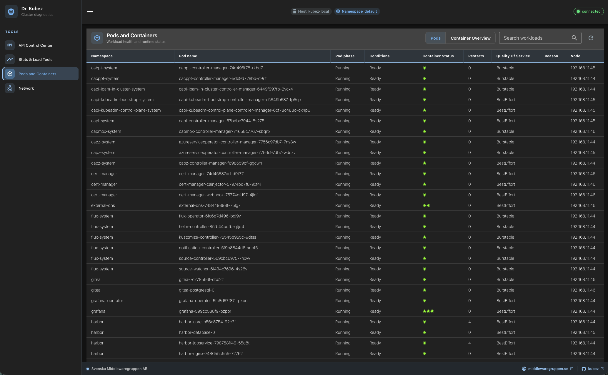
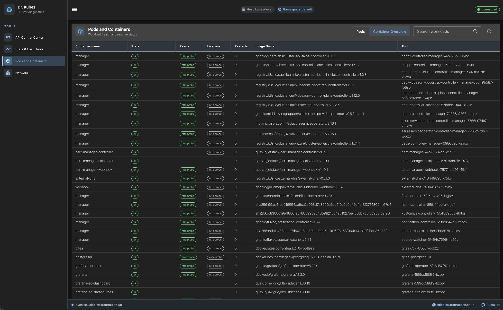

[](https://github.com/middlewaregruppen/kubez/actions/workflows/go.yaml) [](https://github.com/middlewaregruppen/kubez/actions/workflows/node.yaml)

# Welcome to Dr. Kubez

Dr. Kubez is a tool to test, diagnose and load k8s clusters.

## Screenshots

<table>
  <tr>
    <td width="50%">
      <a href="media/pods-view.png"></a>
    </td>
    <td width="50%">
      <a href="media/container-overview.png"></a>
    </td>
  </tr>
  <tr>
    <td align="center"><strong>Pods view</strong></td>
    <td align="center"><strong>Container overview</strong></td>
  </tr>
</table>

To run it in your cluster

```
kubectl apply -f https://raw.githubusercontent.com/middlewaregruppen/kubez/master/install.yaml
```

## Things you can do with it today

### Load

- Load the API Server with gazillions of calls to fill up the etcd database.
- Max out the CPU
- Allocate RAM-memory

### Diagnostics

- View information about CGroups.
- View HTTP Headers that comes in to the container.
- TCP/IP Connection test

### Test:

- Create services that mock endpoints and introduces errors and delays in them.

## Thing we are about to create:

- Hijack k8s services and introduce random errors and delays to them.
- DNS Lookup from inside the cluster.

## Building dr. kubez

```
make frontend
make docker_build
```

## Local development

### Start the server

```bash
go run cmd/kubez/main.go
```

Running it directly will trigger the fallback to load your KUBECONFIG and connect
to the current cluster you're using.

If you want to connect to a different cluster, set the KUBECONFIG environment variable.

or you can run it as a docker container and mount your kubeconfig into it:

```bash
docker run -p 3000:3000 -m 50m --cpus=0.5 \
  -v ~/.kube:/root/.kube:ro \
  -e KUBECONFIG=/root/.kube/config \
  middlewaregruppen/kubez:latest
```

or if you're running kind or minikube, you'll need to add the `--network=host` flag to the docker run command, like this:

```bash
docker run -p 3000:3000 -m 50m --cpus=0.5  --network=host  -v ~/.kube:/root/.kube:ro  middlewaregruppen/kubez:latest
```

To know which one to use, run `kubectl config view --minify | grep server` and
check if the server is running on localhost or on a different IP.

### Working with our OMNI lab setup and a local installation of kubez

To work wiith our OMNI lab setup that uses OIDC to log in, we need to run a proxy

```bash
kubectl --context="$CONTEXT" proxy \
  --address=0.0.0.0 \
  --accept-hosts='^.*$' \
  --port=8001
```

Create a `/tmp/kubez-kubeconfig.yaml` with the following content:

```yaml
apiVersion: v1
kind: Config
clusters:
  - name: local-proxy
    cluster:
      server: http://host.docker.internal:8001
contexts:
  - name: local-proxy
    context:
      cluster: local-proxy
      namespace: default
current-context: local-proxy
users: []
```

Then run with the proxied kubeconfig mounted:

```bash
docker run --hostname kubez-local \
  -p 3000:3000 \
  -m 50m \
  --cpus=0.5 \
  -v /tmp/kubez-kubeconfig.yaml:/kubeconfig:ro \
  -e KUBECONFIG=/kubeconfig \
  middlewaregruppen/kubez:latest
```

### Start vue

```bash
npm run dev --prefix web/frontend
```

Access the ui from `http://localhost:5173`

Kubez will listen to port 3000. Vue listen on 8080. Vue will proxy requests to /kubez to kubez.
